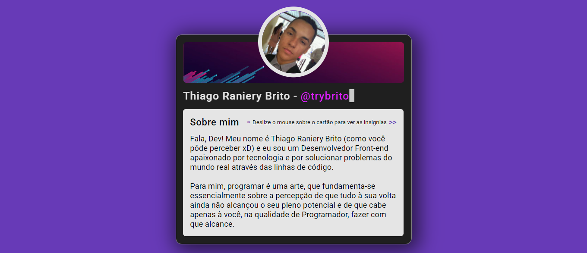

<div align="center">
  <div>
    <h1>Certificard</h1>
    <p>
      <a href="#-about-the-project">About the project</a> •
      <a href="#-status">Status</a> •
      <a href="#%EF%B8%8F-prerequisites">Prerequisites</a> • 
      <a href="#-applied-technologies">Applied technologies</a> • 
      <a href="#-author">Author</a> •
      <a href="#-readme-versions">README versions</a>
    </p>
    
  </div>

  <div>
    
    <a href="https://my-certificard.netlify.app/">
      </a>
    
  </div>
</div>

<hr>

### 🎯 About the project

<p>
  Developed in HTML5 and CSS3, the application consists of a presentation/certification card that groups the links of all the projects that we developed during the two weeks of the aforementioned event, some of which were later redone by me, such as Coinversor, DevCalc and Certificard itself; and which has as its main focus, in terms of development and learning, the minimalist stylization and its animations.
</p>

<hr>

### 🏁 Status

<h3 align="center">
  🎉 Certificard ✔️ Done 🎉
</h3>

<hr>

### ❗️ Prerequisites

Hey, Dev, what's up? Before starting your tests and/or contributions to the project, it is necessary that you have our wonderful [GIT](https://git-scm.com) and a good text editor ([VSCode](https://code.visualstudio.com/), [Sublime Text](https://www.sublimetext.com/), [Atom](https://atom.io/)...) installed.

With everything ready, we can go to the step by step of how to run the application in the development environment.

### 🕹️ Running the application

```bash
# First of all, clone this repository using GIT.
$ git clone <https://github.com/trybrito/certificard>

# Access the project folder from the command line terminal.
$ cd .../certificard

# And open the "index.html" file in your browser, or use the Live Server extension, if you have it installed.
```

<hr>

### 🔮 Applied technologies

- [HTML5](https://devdocs.io/html/);
- [CSS3](https://devdocs.io/css/); and
- [JavaScript](https://devdocs.io/javaScript/).

<hr>

### 👨🏽‍🎓 Author

<div align="center">
  

  <br />

  <div>
    <h3>
      🤝🏽 Thiago Raniery Brito
    </h3>
    <p>
      Hey! Did you like the project? Well, if you want, feel free to contribute to its development and/or contact me through any of the platforms below, see you later! 👋🏽
    </p>
  </div>
  
  <div>
    <a href="https://www.linkedin.com/in/trybrito/" rel="nofollow">
      </a>
    <a href="https://www.hackerrank.com/thiagobritotrs" rel="nofollow">
      </a>
    <a href="https://www.instagram.com/trybrito/" rel="nofollow">
      </a>
    <a href="https://twitter.com/trybrito" rel="nofollow">
      </a>
    <a href="mailto:thiagobritotrs@gmail.com" rel="nofollow">
      </a>
  </div>
</div>

<hr>

### 📚 README versions

<div>
  <a href="https://github.com/trybrito/certificard/blob/main/README.md">Portuguese (pt-br)</a>
  |
  <a href="https://github.com/trybrito/certificard/blob/main/README-en.md">English (en-us)</a>
</div>
