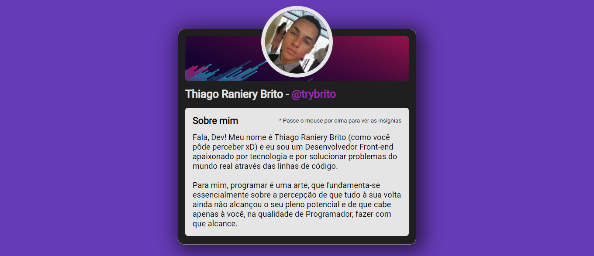

<div align="center">
  <div>
    <h1>Certificard</h1>
    
    <h3>
      🎓 Certificado virtual de participação de um dos meus primeiros eventos de tecnologia/programação, isto é, a Imersão Dev da Alura.
    </h3>
  </div>

  <p>
    <a href="#-sobre-o-projeto">Sobre o projeto</a> •
    <a href="#-status">Status</a> •
    <a href="#%EF%B8%8F-pré-requisitos">Pré-requisitos</a> • 
    <a href="#-tecnologias-utilizadas">Tecnologias utilizadas</a> • 
    <a href="#-autor">Autor</a> •
    <a href="#-readme-versions">README versions</a>
  </p>

  <div>
    
    <a href="https://my-certificard.netlify.app/">
      </a>
    
  </div>
</div>

<hr>

### 🎯 Sobre o projeto

<p>
  Desenvolvida em HTML5 e CSS3, a aplicação consiste em um cartão de apresentação/certificação que agrupa os links de todos os projetos que desenvolvemos ao longo das duas semanas do evento supracitado, sendo que alguns deles foram posteriormente refeitos por mim, caso do Coinversor, da DevCalc e do próprio Certificard; e que possui como enfoque principal, a nível de desenvolvimento e aprendizado, a estilização minimalista e suas animações.
</p>

<hr>

### 🏁 Status

<h3 align="center">
  🎉 Certificard ✔️ Finalizado 🎉
</h3>

<hr>

### ❗️ Pré-requisitos

Fala Dev, beleza? Antes de iniciar seus testes e/ou contribuições no projeto, é necessário que você tenha o nosso maravilhoso [GIT](https://git-scm.com) e um bom editor de texto ([VSCode](https://code.visualstudio.com/), [Sublime Text](https://www.sublimetext.com/), [Atom](https://atom.io/)...) instalados.

Com tudo pronto, podemos ir para o passo a passo de como rodar a aplicação em ambiente de desenvolvimento.

### 🕹️ Rodando a aplicação

```bash
# Primeiramente, clone este repositório com o GIT.
$ git clone <https://github.com/trybrito/certificard>

# Acesse a pasta do projeto pelo terminal de linha de comando.
$ cd .../certificard

# E abra o arquivo "index.html" em seu navegador, ou utilize a extensão do Live Server, caso você a tenha instalado.
```

<hr>

### 🔮 Tecnologias utilizadas

- [HTML5](https://devdocs.io/html/);
- [CSS3](https://devdocs.io/css/); e
- [JavaScript](https://devdocs.io/javaScript/).

<hr>

### 👨🏽‍🎓 Autor

<div align="center">
  

  <br />

  <div>
    <h3>
      🤝🏽 Thiago Raniery Brito
    </h3>
    <p>
      E aí, Dev, gostou do projeto? Bom, se quiser, fique à vontade para contribuir com o seu desenvolvimento e/ou entrar em contato comigo por meio de qualquer uma das plataformas abaixo, até mais! 👋🏽
    </p>
  </div>
  
  <div>
    <a href="https://www.linkedin.com/in/trybrito/" rel="nofollow">
      </a>
    <a href="https://www.hackerrank.com/thiagobritotrs" rel="nofollow">
      </a>
    <a href="https://www.instagram.com/trybrito/" rel="nofollow">
      </a>
    <a href="https://twitter.com/trybrito" rel="nofollow">
      </a>
    <a href="mailto:thiagobritotrs@gmail.com" rel="nofollow">
      </a>
  </div>
</div>

<hr>

### 📚 README versions

<div>
  <a href="https://github.com/trybrito/certificard/blob/main/README.md">Portuguese (pt-br)</a>
  |
  <a href="https://github.com/trybrito/certificard/blob/main/README-en.md">English (en-us)</a>
</div>
